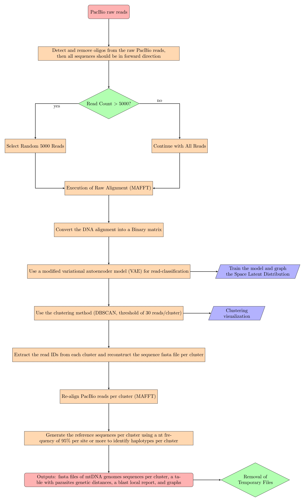

# Haemosporidian Mitochondrial Genome PacBio Pipeline (HmtG-PacBio Pipeline)

## Description
The HmtG-PacBio Pipeline is a comprehensive computational tool designed for processing Haemosporidian mitochondrial genome data from PacBio sequencing. It includes various stages such as primer detection, alignment, DNA sequence conversion to binary format, VAE model (machine learning method), clustering using DBScan, correction sequence, and local BLAST analysis.



## Requirements
- Python 3.x
- MAFFT v7.520
- BLAST 2.6.0
- Various Python Libraries: `TensorFlow 2.14.0`, `Keras 2.14.0`, `BioPython`, `numpy`, `pandas`, etc.

## Installation
1. Clone the repository:
   ```
   git clone [repository-url]
   ```

## Usage

### Arguments
- `-rR`, `--rawReads`: Raw reads from PacBio sequencing (required)
- `-pF`, `--primerF`: Forward primer 5'-3' (default: GATTCTCTCCACACTTCAATTCGTACTTC)<sup>1</sup>
- `-pR`, `--primerR`: Reverse primer 3'-5' (default: GAAGTACGAATTGAAGTGTGGAGAGAATC)<sup>1</sup>
- `-eps`, `--epsDBScan`: Epsilon value for DBScan clustering (default: 1.0)
- `-rF`, `--RemoveFiles`: Option to remove temporary files (default: yes)
- `-rB`, `--blastn`: Option to run BLASTn locally (default: yes)

```
References:

1. Haemosporidian Mitochondrial Genome PacBio Pipeline (HmtG-PacBio Pipeline) Reference
```


### Running the Pipeline
Run the pipeline with the required arguments:
```
python HmtG-PacBio-Pipeline.py -rR [path_to_raw_reads] [options]
```
You can also specify other optional arguments as needed.

## Output
The pipeline generates temporay files at different stages (including aligned sequences, binary format files, cluster data, etc) and four final output files (cluster sequences in fasta format, training model + clustering in a png format, genetics distances and blast output files).


